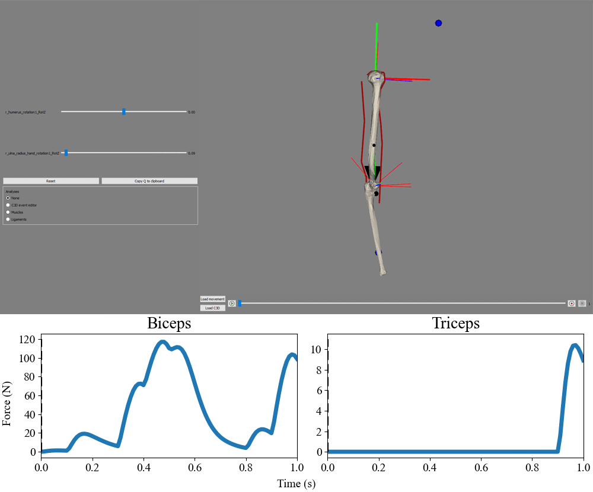

[//]: # ()


# COCOFEST

`Cocofest` : Custom Optimal Control Optimization for Functional Electrical Stimulation, is an optimal control program (OCP) package for functional electrical stimulation (FES).
It is based on the [bioptim](https://github.com/pyomeca/bioptim) framework for the optimal control construction.
Bioptim uses [biorbd](https://github.com/pyomeca/biorbd) a biomechanics library and benefits from the powerful algorithmic diff provided by [CasADi](https://web.casadi.org/).
To solve the OCP, the robust solver [Ipopt](https://github.com/coin-or/Ipopt) has been implemented.

## Status

| Type          | Status                                                                                                                                                                |
|---------------|-----------------------------------------------------------------------------------------------------------------------------------------------------------------------|
| License       | <a href="https://opensource.org/licenses/MIT"></a>                                         |
| Code coverage | [](https://codecov.io/github/Kev1CO/cocofest)                                   |
| Code climate  | <a href="https://codeclimate.com/github/Kev1CO/cocofest/maintainability"></a> |

# Table of Contents 

[How to install Cocofest](#how-to-install)

<details>
<summary><a href="#available-fes-models">Available FES models</a></summary>

- [Ding2003](#ding2003)
- [Ding2007](#ding2007)
- [Hmed2018](#hmed2018)

</details>

[Create your own FES OCP](#create-your-own-fes-ocp)

[Examples](#examples)

<details>
<summary><a href="#other-functionalities">Other functionalities</a></summary>

- [With fatigue](#with-fatigue)
- [Initial value problem](#initital-value-problem)
- [Summation truncation](#summation-truncation)

</details>

[Citing](#citing)


# How to install 
Currently, no anaconda installation is available. The installation must be done from the sources.
Cloning the repository is the first step to be able to use the package.

## Dependencies
`Cocofest` relies on several libraries. 
Based on `bioptim`, the user is invited to directly download the framework from anaconda or from the [sources](https://github.com/pyomeca/bioptim) by cloning the repository
```bash
conda install -c conda-forge bioptim
```
The other [bioptim dependencies](https://github.com/pyomeca/bioptim#dependencies) must be installed as well.

# Available FES models
The available FES models are likely to increase so stay tune.
## Ding2003
Ding, J., Wexler, A. S., & Binder-Macleod, S. A. (2003).
Mathematical models for fatigue minimization during functional electrical stimulation.
Journal of Electromyography and Kinesiology, 13(6), 575-588.

## Ding2007
Ding, J., Chou, L. W., Kesar, T. M., Lee, S. C., Johnston, T. E., Wexler, A. S., & Binder‐Macleod, S. A. (2007).
Mathematical model that predicts the force–intensity and force–frequency relationships after spinal cord injuries.
Muscle & Nerve: Official Journal of the American Association of Electrodiagnostic Medicine, 36(2), 214-222.

## Hmed2018
Hmed, A. B., Bakir, T., Sakly, A., & Binczak, S. (2018, July).
A new mathematical force model that predicts the force-pulse amplitude relationship of human skeletal muscle.
In 2018 40th Annual International Conference of the IEEE Engineering in Medicine and Biology Society (EMBC) (pp. 3485-3488). IEEE.


# Create your own FES OCP
You can create your own FES OCP by following the steps below:
1. Create a new python file
2. Import the desired model from `Cocofest` (e.g. Ding2003) and the fes_ocp class

```python
from cocofest import DingModelFrequency, OcpFes
```

3. Create your own optimal control problem by adding the stimulation pulse number, the number of shooting points,
the final simulation time, the objective function
(for this example, the force at the end of the simulation must be the closest to 100N), 
the minimum and maximum time between two stimulation pulse, the time bimapping
(If True, will act like a frequency at constant pulse interval).

```python
ocp = OcpFes.prepare_ocp(...,
                         n_stim=10,
                         n_shooting=20,
                         ...,)
```

4. Solve you OCP

```python
result = ocp.solve()
```

# Examples
You can find all the available examples in the [examples](https://github.com/Kev1CO/cocofest/tree/main/examples) file.

# Other functionalities

## With fatigue
It is possible to compute the models with their fatigue equations or not.
For example, the "ding2003" model can be use with fatigue DingModelFrequencyWithFatigue or without DingModelFrequency.
If no fatigue is applied, the fatigue equation will not be added to the model and the muscle force will remain 
constant during the simulation regardless of the previous stimulation appearance.

```python
ocp = OcpFes.prepare_ocp(model=DingModelFrequencyWithFatigue())
```

## Initital value problem
You can also compute the models form initial value problem.
For that, use the IvpFes class to build the computed problem.

```python
ocp = IvpFes(
    ding_model=DingModelFrequency(),
)
```

## Summation truncation
The summation truncation is an integer parameter that can be added to the model.
It will truncate the stimulation apparition list used for the calcium summation.
The integer number defines the stimulation number to keep for this summation.

```python
ocp = OcpFes.prepare_ocp()
```


# Citing
`Cocofest` is not yet published in a journal.
But if you use `Cocofest` in your research, please kindly cite this package by giving the repository link.


